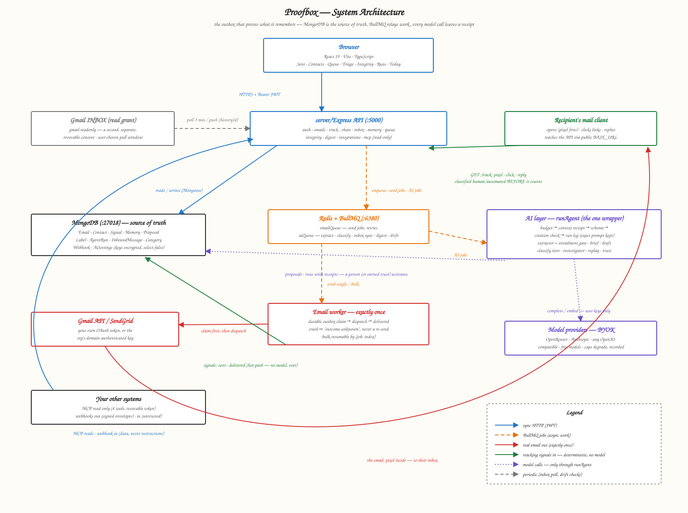

# Proofbox

[](https://github.com/MDub3y/proofbox/actions/workflows/ci.yml)

**Memory systems store what the model says. Proofbox stores only what it can prove.**

## At a glance

It's an outbox that remembers: you send real email through your own Gmail (or your org's SendGrid), it tracks what happens honestly — opens, clicks, replies, document views — and it builds a memory of every contact where **every fact cites the exact email and quote it came from**: commitments with due dates, facts, preferences. The AI only proposes; you approve; nothing is stored it can't prove.

**Who it's for** — anyone whose work lives in email relationships and who can't afford a wrong fact or a dropped promise:

- **Salespeople & founders doing outbound** — "opened the proposal 4 times, read the PDF to page 7, never replied" is a follow-up signal; "they promised a decision by Friday" is a commitment the queue surfaces when Friday passes.
- **Recruiters** — dozens of parallel threads, each full of small promises. Proofbox tracks who owes what, by when, with the receipt.
- **Fundraisers & investor relations** — long gaps between touches; the per-contact brief reopens a thread after 3 months knowing exactly where things stood, with sources.
- **Lawyers, consultants, account managers** — anyone for whom a hallucinated commitment costs real money. The entailment gate exists precisely so the system can never tell you someone agreed to something they didn't.
- **Teams** — org-shared contact memory, so when a colleague hands over an account, the relationship's history doesn't leave with them.

**How it helps, mechanically:**

1. **Nothing promised gets dropped** — the Follow-through queue is rules with reasons (promise due, opened-but-no-reply, went quiet), not a black-box score.
2. **Every "opened" is trustworthy** — scanner prefetches are classified out and disclosed, not counted.
3. **Context survives time and handoffs** — a brief per contact, every claim clickable back to its source email.
4. **Drafts come pre-grounded** in the real history, in your voice — and you always send them yourself.

https://github.com/user-attachments/assets/5fd8e10d-a6af-4c9a-b232-187eed54c941


---

## The numbers

Every claim above is measured, not asserted:

| what's measured | result |
|---|---|
| memory items whose verbatim quote does **not** support the claim — caught by the entailment gate | **24% — dropped, not stored** (what unverified memory systems silently keep) |
| hostile payloads that changed forbidden state (20 payloads × 3 live channels) | **0/60** |
| duplicate sends across worker crashes at 8 kill points (in CI) | **0** |
| real opens wrongly suppressed by the open classifier | **0** (precision 100%; the unavoidable residual is disclosed, not hidden) |
| inbox classification on the 38-message golden set (free model, $0) | **38/38** |
| [LoCoMo](https://github.com/snap-research/locomo) memory benchmark — three runs, regressions included | [table below](#benchmarks) |

Three invariants make it safe to run on your own mail:

- **The model is never on a hot path.** The pixel, the click redirect, and sending are deterministic code; a test fails the build if they ever import the AI layer.
- **Nothing a model produces changes state by itself.** Every output is a proposal you accept, edit, or reject — and every decision is a label the evals and calibration grow from.
- **Text from other people is data, not instructions.** Replies, inbound mail, and webhooks reach a model only inside a delimited untrusted block, and anything extracted from them is proposed, never active.

---

## Architecture

A sender that tracks what happens to its email, and a memory that remembers what those signals mean per contact. The model never sits between them: it reads and proposes, a person decides, deterministic code does the rest.



How one signal becomes memory:

1. You send. The queue injects the pixel, rewrites links, sets a `Message-ID` carrying the tracking token, records a `sent` signal.
2. Their mail client fetches the pixel. The classifier decides `human` or `automated` *before* the signal is stored; a scanner prefetch is stored, honestly labelled, never counted.
3. They reply. The sync matches it by thread id or `Message-ID`, records a `reply` signal, and the category policy decides whether a model may read it.
4. The extractor reads the reply as untrusted text and proposes items, each with a verbatim quote, each entailment-checked. You accept one; it becomes active memory with the email as its source.
5. The brief rewrites from active items, citing them by id. Next week the queue says "they promised the headcount by Friday", and the draft's receipt shows exactly what the model saw.

<details>
<summary><b>The code map</b> — where everything lives</summary>

```
server/src/
├── ai/            everything that touches a model; never imports the send path
│   ├── runAgent.ts        the one wrapper: budget, receipt, schema, citation check, run log
│   ├── memory/            extraction, entailment gate, policy, brief, engagement
│   ├── providers/         BYOK: Anthropic + any OpenAI-compatible host, capabilities at runtime
│   ├── classify/          inbox tiers: header rules → embeddings/LLM → local
│   ├── investigate/       bounded tool-using investigator over anomalous signals
│   ├── voice/ draft/ digest/ replay/ trustPolicy.ts corrections.ts
│   └── evals/             extraction, injection, classifier, classification, draft, LoCoMo
├── services/      deterministic product code: signals, queue rules, open classifier,
│                  inbox sync, digest, webhooks, shared memory, export, dispatch
├── queues/        emailQueue (exactly-once sending) and aiQueue
├── mcp/           read-only MCP server (4 tools) for other agents
└── models/        Email, Contact, Signal, Memory, Proposal, Label, AgentRun, …

client/src/pages/  Today · Sent · Contacts · Queue · Triage · Integrity · Runs ·
                   AI settings · Integrations · Documents · BulkCompose
```

</details>

<details>
<summary><b>Engineering story</b> — emails marked "opened" that were never opened</summary>

During testing, emails flipped to `opened` seconds after sending, untouched by any human. Pulling the raw event data showed two tells: every false open landed 3–40s after delivery, and some carried a User-Agent claiming to be three browsers at once (`Chrome/42… Safari… Edge/12.246`) — a synthetic fingerprint. The cause: Gmail and every major provider prefetch and scan images in new mail through the same proxy a real open uses, indistinguishable at the network level by design. Every pixel product (Mailtrack, HubSpot, Yesware) has this false positive; none can eliminate it.

The fix classifies each hit before it counts: the scanner UA fingerprint, plus a 3-second timing floor. The first version used a 60-second window — it killed the false positives but swallowed *real* fast opens, which is worse for a read-receipt product than a rare disclosed false positive. Timing was standing in for the real signal (the UA), so the window shrank to only what no human reaction can explain. The residual — a proxy prescan past the floor with a clean UA — is accepted and *disclosed in the UI*, not hidden. Misclassified history was reclassified both times.

</details>

---

## Benchmarks

Proofbox's memory ran unmodified against **LoCoMo** conversation 0: 419 turns replayed as email, all 199 questions answered from stored memory only, scored with deterministic token-F1 (stricter than the LLM-judge numbers most systems publish — compare shapes, not absolutes).

| run | extractor / memory | answerer | overall | single-hop | multi-hop | temporal | open-dom. | adversarial |
|---|---|---|---|---|---|---|---|---|
| 1 | nemotron (free), no date resolution | nemotron | **40.2%** | 53% | 28% | 5% | 38% | 57% |
| 2 | gpt-oss-120b, dates resolved | gpt-oss-120b | 34.7% | 44% | 34% | **24%** | 15% | 34% |
| 3 | gpt-oss-120b, dates resolved | nemotron | 32.7% | 46% | 25% | **22%** | 15% | 32% |

The three runs isolate one shipped fix — resolving relative time words against the email's date took temporal recall from 5% to 22–24% independent of the answering model — and attribute the regressions to the extraction-model swap, not the answerer. Total cost including every failed experiment: **$0.47**. Chat benchmarks structurally can't measure email-native memory (multi-party attribution, quote-chains, poisoning), which is why the next step is **[ThreadMem](https://github.com/MDub3y/threadmem)** — our pre-registered benchmark for exactly that, with non-self baselines.

<details>
<summary><b>The AI layer in depth</b> — six phases, each with its eval</summary>

**Ground rules:** one wrapper (`runAgent`) for every model call — budget ceiling, context receipt, schema validation, cited-id verification, stored prompt, run log. Features a model lacks degrade and are recorded, never fatal. Deterministic before generative. Every correction is a label. Bring your own key (Anthropic / OpenAI / OpenRouter / any compatible host, free models included), stored encrypted.

- **Memory** — typed items (commitment/fact/preference) with verbatim quotes, verified at three levels: the cited email was in context, the quote is verbatim in it, and a judge confirms the quote *entails* the claim (fail closed). Eval: `npm run eval:extraction` — recall, quote validity, cited-but-unsupported rate.
- **Drafting** — follow-up drafts with a receipt (what was used, what was left out and why), in your voice, never auto-sent. Eval: `npm run eval:draft` (four-check judge).
- **Signal integrity** — rule-driven open/click verdicts, human labels override and feed a measured set; a bounded investigator proposes new rules with evidence you accept or reject. Eval: `npm run eval:classifier` (exits 1 on regression).
- **Inbox triage** — mail sorted in tiers *before* any model reads it (free header rules → cheapest classifier your key serves), per-category read policies (never/ask/auto). Eval: `npm run eval:classification` — 38/38.
- **The doors** — Today digest; signed webhooks in/out; a read-only MCP server (`contact_brief`, `contact_timeline`, `queue`, `search_commitments`); markdown export.
- **Replay & trust** — every run keeps its exact prompt and replays under variant prompts/models, diffed against your recorded decisions; autonomy is earned per kind from your own acceptance rate, with visible thresholds. `npm run replay -- --drift`.
- **Adversarial** — `npm run eval:injection`: 20 hostile payloads × 3 channels, scored on forbidden state changes. Current: 0/60.

</details>

**What it cannot do:** send anything or change memory from behind any door or model · tell a clean-UA proxy prescan from a real open past the timing floor (every pixel product shares that residual; it's reported) · replay tool-using runs with live tools · serve Google consent outside the test-user list until the app passes Google verification.

---

## Running locally

**Prerequisites:** Node 18+, Docker, a Google Cloud OAuth client with the Gmail API enabled, and a public HTTPS tunnel (e.g. `ngrok http 5000`) so the tracking pixel is reachable.

```bash
docker compose up -d                 # MongoDB :27018, Redis :6380
cd server && cp .env.example .env    # fill in Google OAuth client + tunnel URL
npm install && npm run dev           # API on :5000
cd ../client && npm install && npm run dev   # app on :5173
npm test                             # 174 tests (in server/)
```

The AI layer is off until `AI_ENABLED=true`; users add their own provider keys in-app (encrypted at rest). While the Google OAuth client is in "Testing" status, only listed test users can connect — early users go on that list (see [ONBOARDING.md](ONBOARDING.md)); public use requires Google's verification review. Enterprise orgs skip Google entirely with their own SendGrid key.

<details>
<summary><b>Stack</b></summary>

Node + TypeScript · Express · MongoDB/Mongoose · Redis/BullMQ · React 19 + Vite · JWT + Google OAuth 2.0 · Gmail API / SendGrid · Zod-validated structured output · `@modelcontextprotocol/sdk` (read-only, Streamable HTTP) · Docker for local infra.

</details>

## Security

- Gmail tokens and SendGrid keys stored `select: false`, never returned by any API; BYOK provider keys AES-GCM encrypted at rest
- Exactly-once sending: a durable outbox claim precedes every provider call; ambiguous crashes surface as "outcome unknown", never a silent re-send
- Share-link passwords bcrypt-hashed; PDFs served via short-lived view tokens; UUID filenames with server-side path-traversal checks; regex input escaped against ReDoS
- The pixel endpoint always returns a valid image — a broken image would reveal the tracking
